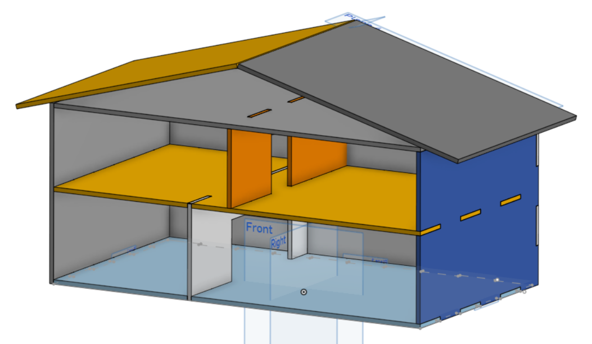

# Maison Connectée - Domotique Miniature

## Description
Ce projet vise à créer une maquette de maison connectée en utilisant des capteurs et des actionneurs pour simuler des systèmes de domotique. L'objectif est de démontrer comment les technologies modernes peuvent être utilisées pour améliorer le confort et l'efficacité énergétique d'une maison.

## Objectifs
- Surveiller et ajuster les conditions climatiques intérieures à l'aide de capteurs de température et d'humidité.
- Ajuster l'éclairage en fonction du niveau de lumière ambiante.
- Automatiser l'éclairage et d'autres appareils en détectant la présence humaine.
- Contrôler des appareils domestiques à distance via des modules de communication sans fil.

## Fonctionnalités
- **Capteurs de température et d'humidité :** Utilisation de DHT11 ou DHT22 pour surveiller les conditions climatiques.
- **Actionneurs :** Utilisation de relais ou de transistors pour contrôler des lampes et des ventilateurs.
- **Microcontrôleurs :** Utilisation d'Arduino ou Raspberry Pi pour la programmation et le contrôle des capteurs et des actionneurs.
- **Affichage d'informations :** Utilisation de NodeRed Dashboard pour afficher les données captées.
- **Capteur de qualité de l'air :** Utilisation du MQ-135 pour surveiller les polluants et la qualité de l'air.
- **Modules de communication :** Utilisation de modules Wi-Fi ou Bluetooth pour le contrôle à distance.

## Technologies Utilisées
- **Capteurs de température et d'humidité :** DHT11, DHT22
- **Capteur de lumière :** BH1750
- **Capteurs de mouvement :** PIR (Passive Infrared Sensor)
- **Actionneurs :** Relais, Transistors
- **Microcontrôleurs :** Arduino, Raspberry Pi
- **Écrans :** LCD, OLED
- **Capteur de qualité de l'air :** MQ-135
- **Modules de communication :** Wi-Fi, Bluetooth

## Équipe de Projet
- **Lucas TARDIF:** Rôle : 3D Builder | Developper
- **Maxence GELIG :** Rôle : Main Developper
- **Timothée DUTOIS :** Rôle : Project Manager

## Livrables
- **Maquette fonctionnelle de la maison connectée**
- 
- **Rapport technique détaillant les composants et le code utilisé**
- **Présentation finale du projet**

- ## Évolutions possibles
- **Capteurs de lumière :** Utilisation du BH1750 pour ajuster l'éclairage en fonction de la luminosité ambiante.
- **Capteurs de mouvement :** Utilisation de capteurs PIR pour détecter la présence humaine et automatiser les appareils.
- **Ajout des données en base | Historisation :** Système d'historique complet pouvant servir par la suite à une analyse. (pertes de chaleur de la maison par exemple)

## Références
- [DHT11/DHT22 Documentation](https://www.adafruit.com/product/386)
- [BH1750 Capteur de lumière](https://www.sparkfun.com/products/retired/12055)
- [Capteur PIR](https://www.adafruit.com/product/189)
- [MQ-135 Capteur de qualité de l'air](https://www.adafruit.com/product/3199)
- [Arduino Documentation](https://www.arduino.cc/en/Guide)
- [Raspberry Pi Documentation](https://www.raspberrypi.org/documentation/)
- [Modèle de la maison](https://cad.onshape.com/documents/de840b971062f1b6a3d2750f/w/ea7fc6207572d0be96b95fa8/e/23b2df6f54c7adfef7c06e8f)

